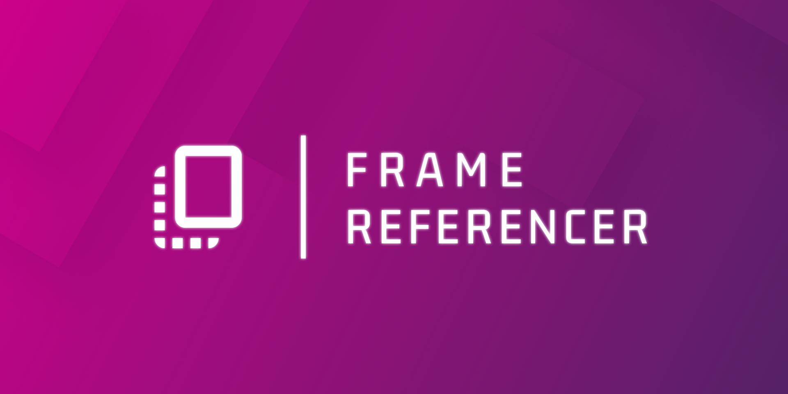
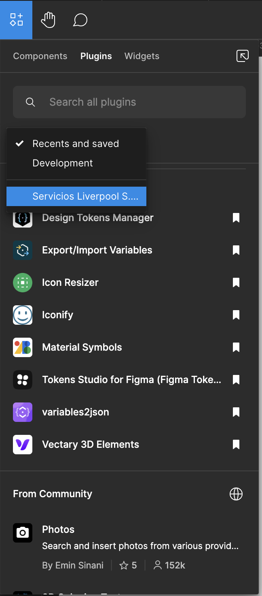
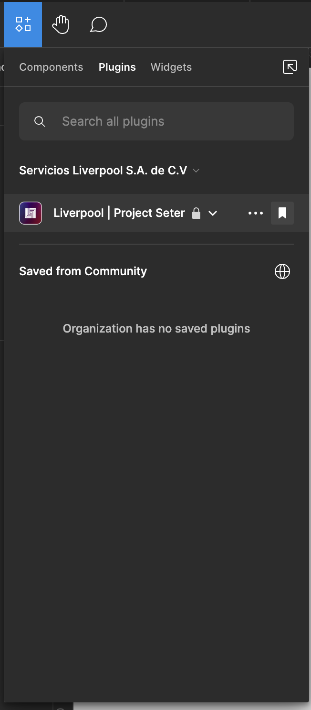

#  Liverpool | Project Setter


Este proyecto busca brindar una seríe de herramientas variadas que permitan generar relación entre dos frame dentro de un solo proyecto

## 🧐 Descripción

Nacido de la necesidadd de crear y mantener relación entre dos frames dentro de un mismo proyecto, este proyecto busca brindar una seríe de herramientas variadas que permitan generar relación entre dos frame dentro de un solo proyecto.

Con esto, el plugin permite crear hipervinculos entre dos frames, dibujar un conector que indica la relación entre dos frames y generar copias de bajo consumo de un frame dentro de otro.

Para poder hacer el consumo inteligente y distribuido de componentes por página dentro del nuevo proyecto primero se opto por la creación de una librería de diseño que se encuentra para su consulta dentro del siguiente vínculo: [Liverpool | 🧩 Template Library](https://www.figma.com/file/zPktzlFLPvkbDunS3vSBVd/Template-library?type=design&node-id=1597%3A6659&mode=design&t=NX5sCHNbxK66QaHd-1)

Bajo estas tres mecánicas es que el diseñador puede customizar sus referencias y generar un proyecto que se adapte a sus necesidades.

Las principales tecnologías usadas para la comunicación con figma son:

-  [Figma API:](https://www.figma.com/developers/api) Para la comunicación con figma logrando consulta y escritura de elementos dentro del canvas de trabajo.
-  JavaScript: Como parte del lenguaje de programación para la creación de la extensión.
-  TypeScript: Como parte del lenguaje de programación para la creación de la extensión.

En esta versión 1.0 se han integrado funcionalidades tales como:

- 🎨 Selección de color para conectores e hipervinculos
- 📝 Sobreescritura y creación de copias de frames
- 🔗 Generación de hipervinculos entre frames
- 🔌 Generación de conectores entre frames

Sin embargo futuras actualizaciones y mejoras de rendimiento se estarán realizando al proyecto.

## 👓 Para usar el proyecto

### Compilación de code.ts -> code.js

El proyecto utiliza TypeScript para la construcción de la extensión por lo cual, es necesario utilizar un compilador para poder generar el archivo JavaScript que se ejecutara dentro de Figma.
Para esto se recomienda ingresar dentro de la terminal de Visual Studio Code y ejecutar el comando:

```bash
tsc code.ts -w
```

Esto generara un archivo code.js que se ejecutara dentro de Figma y que se estará actualizando cada vez que se realice un cambio en el archivo code.ts.
Tendras que mantener la terminal abierta para que el archivo se actualice.

### Ver comentarios en el código

Para ver mejor la documentación se recomienda descargar la extensión Better Coments para poder visualizar los comentarios en el código de mejor manera.
Ingresa a better-comments y modifica el json de configuración de la siguiente manera:

```json

"workbench.iconTheme": "vscode-icons",
"workbench.productIconTheme": "el-vsc-v1-icons",
"better-comments.highlightPlainText": true,
"better-comments.tags": [
	{
		"tag": "!",
		"color": "white",
		"strikethrough": false,
		"underline": false,
		"backgroundColor": "#FF2D0040",
		"bold": false,
		"italic": false
	},
	{
		"tag": "?",
		"color": "white",
		"strikethrough": false,
		"underline": false,
		"backgroundColor": "#3498DB40",
		"bold": false,
		"italic": false
	},
	{
		"tag": "//",
		"color": "white",
		"strikethrough": true,
		"underline": false,
		"backgroundColor": "#47474740",
		"bold": false,
		"italic": false
	},
	{
		"tag": "todo",
		"color": "white",
		"strikethrough": false,
		"underline": false,
		"backgroundColor": "#FF8C0040",
		"bold": false,
		"italic": false
	},
	{
		"tag": "*",
		"color": "white",
		"strikethrough": false,
		"underline": false,
		"backgroundColor": "#98C37940",
		"bold": false,
		"italic": false
	},
	{
		"tag": "param",
		"color": "white",
		"strikethrough": false,
		"underline": false,
		"backgroundColor": "#0176ff40",
		"bold": false,
		"italic": false
	},
	{
		"tag": "main",
		"color": "white",
		"strikethrough": false,
		"underline": false,
		"backgroundColor": "#EF5DA840",
		"bold": false,
		"italic": false
	},
	{
		"tag": "funcion",
		"color": "white",
		"strikethrough": false,
		"underline": false,
		"backgroundColor": "#9f7dff40",
		"bold": false,
		"italic": false
	},
	{
		"tag": "import",
		"color": "white",
		"strikethrough": false,
		"underline": false,
		"backgroundColor": "#f4767740",
		"bold": false,
		"italic": false
	}
]

```

### Correr el plugin dentro de Figma

Para hacer correr el plugin dentro de Figma basta con pertenecer a la organización de "Servicios Liverpool S.A. de C.V." y seguir las siguientes instrucciones:

1. Dirigete a la sección de PlugIns dentro de Figma


<br/>

2. Da click en "Recents and saved" y despues en "Servicios Liverpool S.A. de C.V."
   

<br/>

3. Allí encontraras el plugin "Liverpool | Project Seter" y podrás guardar el PlugIn dentro de tus favoritos o iniciarlo desde allí.


